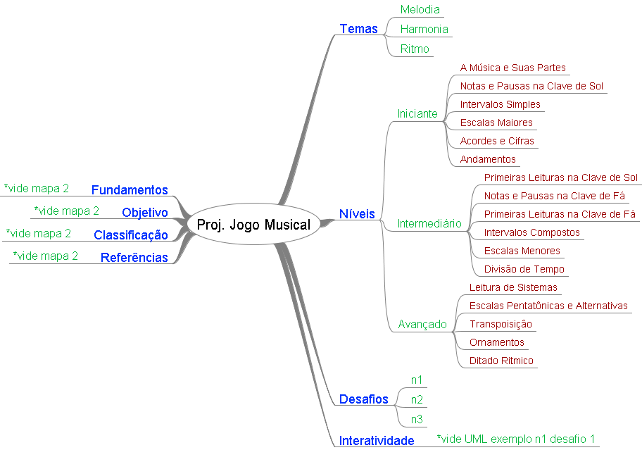

# Anotações das reuniões

## 2021-01-05

.. escreveu por e-mail ..  
Olá Dalton, tudo bem?  
No próximo semestre iniciarei a disciplina de TCC I e gostaria de já definir um tema para o meu TCC.  
Gostaria de fazer algo voltado para educação infantil, mas não tenho nenhuma ideia definida.  
Estou aberta a verificar outros temas também.  
Você poderia me ajudar?  
Atenciosamente,  
Caroline Belli Regalin.  

## 2021-01-25

Respondi para agendarmos para conversar sobre o TCC.  

## 2021-03-01

Conversamos para trabalhar na idéia do TCC _  

- não: baixo nível (hardware)  

_ SIM __

- Unity (C# gráfica)  
- Flutter (móvel não parte gráfica)  
.. moderno  

Um problema que possa ajudar: contribuição  

- Educação Especial (parei)  
- Ambiental: química, biologia  

Escolhe assunto: moda, interdisciplina  
Ciência dos dados -> Coletar dados  
Inteligência Artificial ..  

Quinta livre (período normal 18:00~20:00) após as 18:00  

TCC2 sozinho ==> 10,0  

## 2020-02-26

Oi, não me esqueci de você não :-) ... Só estava organizando algumas coisas, e também tive tempo para conversar com alguns professores que fazem parte deste projeto. Os nossos especialistas no assunto relacionado a preservação ambiental, etc.  

Bom, acho que seria interessante trabalhares no projeto do Aquário Virtual. Peço que dê uma olhada para poderes se inteirar sobre o assunto. E assim construímos juntos as suas perguntas de pesquisa e objetivos do TCC1.  
É um projeto que já teve a participação de dois TCC:  

### Aquário Virtual

- primeiro TCC FlavioOmar: Aquário Virtual: Simulador de Ecossistema Utilizando Interface de Usuário Tangível
<https://furb-my.sharepoint.com/:b:/g/personal/dalton_furb_br/EYhcWZ4sE31LkSPUFAjMvygBeYhFI1f8Q9YJ1TchsHodBA?e=Kb1OqV>  
- segundo TCC MatheusWaltrichSilva: Aquário Virtual: Multiplayer e Realidade Virtual
<https://github.com/dalton-reis/tcc_MatheusWaltrichSilva/blob/master/_TCC2_entregue/textos/tcc_bcc_2020_1_matheuswaltrich_MatheusWaltrichDaSilva-VF.pdf>  

E este semestre tem um bolsista da segunda fase de BCC que vai "mexer" um pouco nele. Penso que poderia ser incorporado nele melhorias apontadas nos dois TCCs (acima), ou ainda trazer uma outra funcionalidade já explorada em um outro TCC.  
No caso o uso de IA no comportamento dos animais.  

### TCCs que podem ser usados

- Unity+IA JoaoMarcoEstevao: Análise do Uso de Animação Comportamental com o Motor de Jogos Unity
<https://github.com/dalton-reis/tcc_JoaoMarcosEstevao/blob/master/_TCC2_entregue/Texto/tcc_bcc_2020_1_jmestevao_JoaoMarcosEstevao-VF.pdf>  

Senão conseguires acessar algum material me avise.  
E também me avise quando terminares. Assim vamos para o próximo etapa.  
Bom, boa leitura ...  

## 2020-03-04

### Definição do Assunto do TCC

olhamos a opção de trazer Unity IA do TCC do João para o Aquário mas aparecer a dúvida de quão os peixes teriam "inteligência".  
Mostrei o TCC do Jonathan, pois gostou por ser um material educacional e usar IUT. Mas fica a dúvida do grau de dificuldade do reconhecimento das peças.  
Outra opção seria extender o TCC do João.  
Vai decidir entre extender o TCC do João e o TCC do Jonathan.  

## 2020-03-11

Mudou para o assunto de ensinar música .. alfabetização musical.  

### Indiquei para leitura os TCCs

- Roberto Weege Junior: <http://dsc.inf.furb.br/arquivos/tccs/monografias/2018_2_roberto-weege-junior_monografia.pdf>  
- Paulo Felipe Piva dos Santos: <http://dsc.inf.furb.br/arquivos/tccs/monografias/2019_2_paulo-felipe-piva-dos_monografia.pdf>  

Mensagem do prof. de Música ___  
No campo da Educação Musical, especificamente, decorar alguns nomes para compreender a sutil diferença entre uma e outra posição da nota musical no diagrama, dependendo da clave e da tessitura utilizadas, é uma tarefa fundamental no processo de Alfabetização Musical do educando. Por outro lado, o número de analfabetos musicais no Brasil é estrondoso. Na verdade a Alfabetização Musical no Brasil, embora um país evidentemente musicalizado, ainda é um privilégio, uma espécie de eruditismo que separa músicos de músicos, apreciadores de apreciadores. Uma criança musicalmente alfabetizada certamente poderá apreciar com mais gosto uma peça musical, seja um funk ou uma opera.  
Neste sentido, ferramentas que auxiliem no processo de aprendizagem são sempre soluções interessantes.  

Solução:  
Criar um Game cuja missão do jogador seja acertar o nome das notas, dos tempos,dos elementos que compõem uma partitura, fase a fase, ajudando o educando a desenvolver o que chamamos de 'leitura à primeira vista'.  

Funcionalidades (exemplos de desafios):  

- Acertar o nome das Notas na Pauta (conforme a clave)  
- Ouvir e Acertar a Divisão de Tempo  
- Ouvir e Acertar a Nota Musical  
- Ouvir e Acertar o Intervalo -Ler e Acertar o Intervalo  

## 2021-03-15

Enviou um link com um exemplo enviado pelo professor de música: <https://www.youtube.com/watch?v=lR71VckFoZY>  

## 2021-03-16

Enviado pelo prof. de Música.  
  

## 2021-03-25

Perguntas feitas pela orientanda:  

- prazo para entregar o texto para revisar: 1 semana e 1/2  
- trabalhos correlatos: pode pegar algum que não seja de música, tipo Duolingo.  

Mostrei o <https://apps.apple.com/us/app/bandimal/id1065440354>  
<https://www.youtube.com/watch?v=6MS3bImVKc0>  
mais para composição músical, mas pode aproveitar algumas ideias pois é "cativante".  

## 2021-05-04

### Defesa Pré-projeto

[Anotações de defesa do Pré-projeto](./tcc_CarolineBelliRegalin_2021-05-04_PreProjeto_Defesa.md)  

## 2021-08-13  

Caroline: criar um Git -> dalton-reis  

- sobre disciplina de TCC2  
  <http://www.inf.furb.br/lci/interno.php?secao=183>  

### Parte teórica x prática

#### Parte teórica

- máximo 4 semanas só parte prática  
- pegar com TCC2 os ajustes da banca no projeto  
- ATENÇÃO: as correções são para o artigo (não no projeto)  
- Ver revisão da banca do projeto (Luciana / Andreza): <https://github.com/dalton-reis/tcc_CarolineBelliRegalin/blob/main/_dalton/tcc_CarolineBelliRegalin_2021-07-05_Projeto_Banca_revisao.pdf>  
- Ver revisão do prof. de TCC2  
- Pensar em algumas coisas (cronograma):  
  - pessoal para testar  
    - turma da disicplina  
      ...

#### Parte prática  

Está usando uma Linguagem Dialógica.  

Professor: Cris  

## 2021-08-20

Conversou com o prof. Cris, gostou e deu mais ideias a mais. E mais alguns outros exemplos de aplicativos.  

### Perfil dos alunos

- música: iniciante  
- gamificação: faixa etária: adolecentes  

No artigo mencionar a precupação de saber qual o perfil do usuário. No caso da gamificação se escolheu um.  

### implementação

[x] Integração com o Heroko + ProstGress  
[ ] aula de música  
[ ] usar o Figma (prototipador de tela) para interface como no TCC do Leoanrdo.  
[ ] usar um site com imagens SVG.  
[ ] fazer POC de audio.  
[ ] fazer POC de telas.  

## 2021-08-30

[x] fazer POC de audio.  
[x] aula de música  
[x] usar o Figma (prototipador de tela) para interface como no TCC do Leonardo.  
      DrawIO -> Figma -> Flutter
             mão  ... automático (organizar poucas coisas)  
Não ter som em "paralelo" ... só vai tocar um som por vez.

Vai fazer o Figma e BackEnd/FrontEnd

## 2021-09-10

Criar UI usando componitização.  
Não conseguiu usar o Figma.  
Tentou usar um plugin que instalou no Figma, mas gerou um código que a UI estava meio quebrada.  
Tentou um conversor externo e deu erro.  
Está fazendo a UI na Mão.  

## 2021-09-17

Fez o modelo do exercício.  
Trabalhou nas telas.  
Fez transição entre telas.  
Flutter "modular" .. componente ..
[ ] @dalton-reis - flutter_modular: <https://pub.dev/packages/flutter_modular#getting-started-with-modular>

### Artigo

Já recebeu as correções do Maurício.  
Está aula de Teoria Musical com prof. Renato.  
Iniciar o artigo sem falta em outubro.  
[x] Ver como fazer engenharia reversa no Flutter, para PlantUML: <https://pub.dev/packages/dcdg>  
Mauricio pediu para tirar revisão o Flutter.  
Lembrar de trazer os MoCaps de tela para mencinar no artigo.  

## 2021-09-24

Não tivemos reunião.  

## 2021-10-01

- Já fez os exercícios de tipos diferentes.  
- Já fez a tela pontuação.  
- Vai fazer o controle de pontuação.  
- Vai passar para o Especialista.  
- Vai pegar ferias em 11/10.  
- Vai começar o artigo em 11/10.  
- Vai gerar uma Release no GitHub, e gerar APK para Chris, e vai me avisar.

## 2021-10-08

Desmarquei

## 2021-10-15

Dúvidas sober a forma como fazer a persistência na nuvem. Tentou usar FireBase mas não estava conseguindo.  
Perguntou se poderia usar uma outra já feita nas POCs. Disse que sim.  

## 2021-10-22

- Nuvem Hasura .. usando GraphQL.  
- Antes vai ter a narativa do Jogo.  
- Sessão: Introdução, Melodia, Ritmo e Elementos da Músicas. 5x  
  - Níveis: .. 2 ou 3.  3x  
    - Exercícios ..  
- Pontuação: medalhas (instrumento)  

-> bolsista de UniEdu para buscar imagens e produção da Narativa da Apresentação.  

## 2021-11-05

Mostrou para o prof. Cris, gostou. O Cris esta separando o conteúdo.  
Pediu para ter uma interface para alterar os exercícios. Vai para extensão.  
Artigo: vai começar a escrever.  

Ajustes dos fontes no GitHub.

## 2021-11-26

@cregalin enviou [tcc_CarolineBelliRegalin_2021-11-26_Artigo.docx](tcc_CarolineBelliRegalin_2021-11-26_Artigo.docx) .. falta resultados. @dalton-reis revisar.  

## 2021-12-03

Os testes com o Chris vai ser dia 04/12 (sábado). Disse que segurava um pouco a entrega, mas era para ir fazendo o artigo e preenchendo o máximo possível. Já podia ir fazendo os slides também.  

@dalton-reis, fazer testes no iOS.  
<https://console.firebase.google.com/u/0/project/musicando-654a0/overview?pli=1>  
<https://play.google.com/apps/internaltest/4699875196678608804>  
<https://play.google.com/store/apps/details?id=com.cregalin.music_app&hl=pt-BR&ah=r4JKVxSMiperVB1kPtLFPKpohqU>  

## 2021-12-15

Defesa do TCC  
[tcc_CarolineBelliRegalin_2021-12-15_defesa_video.mp4](tcc_CarolineBelliRegalin_2021-12-15_defesa_video.mp4)  
[tcc_CarolineBelliRegalin_2021-12-15_defesa_ata.pdf](tcc_CarolineBelliRegalin_2021-12-15_defesa_ata.pdf)  
[tcc_CarolineBelliRegalin_2021-12-15_defesa_Luciana.pdf](tcc_CarolineBelliRegalin_2021-12-15_defesa_Luciana.pdf)  
[tcc_CarolineBelliRegalin_2021-12-15_defesa_Marcel.pdf](tcc_CarolineBelliRegalin_2021-12-15_defesa_Marcel.pdf)  
